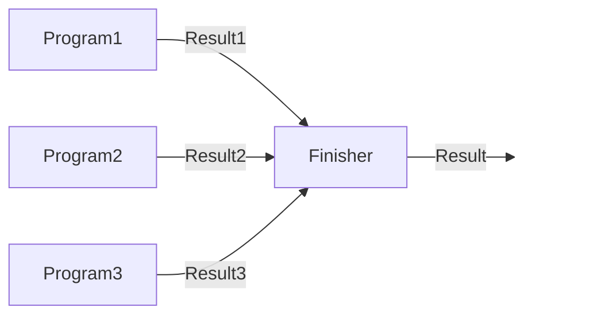

# diesel

Generate DSLs in Java using an annotation processor and combine them all together.

## Name

The name of the project is the literal spelling of DSL acronym.

## Disclaimer

This library is still in **development**. Use it at you own risk.

## Requirement

This library is based on Java 25.

## Usage

The idea is to create DSLs for your application. You can annotate your interface with `@Diesel` and 
the annotation processor will generate the DSL with all the boilerplate code for you.

For example this interface:

```java
import com.github.tonivade.diesel.Diesel;

@Diesel
public interface Console {
  String readLine();
  void writeLine(String line);
}
```

will be transformed into:

```java
import com.github.tonivade.diesel.Program;
import com.github.tonivade.diesel.Result;
import javax.annotation.processing.Generated;

@Generated("com.github.tonivade.diesel.DieselAnnotationProcessor")
public sealed interface ConsoleDsl<T> extends Program.Dsl<Console, Void, T> {

  record ReadLine() implements ConsoleDsl<String> {
  }

  record WriteLine(String line) implements ConsoleDsl<Void> {
  }

  static <S extends Console, E> Program<S, E, String> readLine() {
    return (Program<S, E, String>) new ReadLine();
  }

  static <S extends Console, E> Program<S, E, Void> writeLine(String line) {
    return (Program<S, E, Void>) new WriteLine(line);
  }

  @Override
  default Result<Void, T> handle(Console state) {
    var result = (T) switch (this) {
      case ReadLine() -> state.readLine();
      case WriteLine(var line) ->  {
        state.writeLine(line);
        yield null;
      }
    };
    return Result.success(result);
  }
}
```

After that you could use the DSL inside a program:

```java
import static ConsoleDsl.*;

public static void main(String... args) {

  var program = writeLine("What's your name?")
    .flatMap(_ -> readLine())
    .flatMap(name -> writeLine("Hello " + name + "!"));

  // output of the program:
  // >> What's your name?
  // << Toni
  // >> Hello Toni!
  program.eval(new Console() {
    public void writeLine(String line) {
      IO.println(line);
    }
    public String readLine() {
      return IO.readln();
    }
  });
}
```

## Program

`Program` is the base of this library. It's pretty similar to a IO monad but with the ability to 
extend with additional operations.

You can generate additional operations using the annotation processor. The generated code is based 
on `Program` and you will need to combine them to build your programs.

There are two basic combinator methods `zip` (and the parallelized version called `parZip`) and `pipe`. 

### Zip

With `zip` you can combine different operations, and with the result of each operation, generate a 
result.



For example:

```java
  var program = zip(
    program1,
    program2,
    program3,
    (r1, r2, r3) -> new Result(r1, r2, r3)
  );
```

There's a variant of `zip` called `parZip`. This variant will execute all operations in parallel using
an `Executor`. It will wait until all the operations are completed and after that, the finisher will be
called.

```java
  var program = parZip(
    program1,
    program2,
    program3,
    (r1, r2, r3) -> new Result(r1, r2, r3),
    executor
  );
```

### Pipe

Pipe can be used to create a pipeline of operations, using the result of execute the first operation
as input of the next operation. Finally the result will be the result of the execution of the last 
operation in the pipeline.


For example:

```java
  var program = pipe(
    program1,
    r1 -> program2,
    r2 -> program3
  );
```

### Validate

Validate can be used to validate if an object meets some criteria and it's well formed

```java
  record User(Integer id, String name) {}
  
  //...
  
  var program = validate(
      user,
      Validator.of(User::id, id -> id != null, "Id must not be null"), 
      Validator.of(User::name, name -> name != null && !name.isEmpty(), "Name must not be null"))
  );
```

Validate is composed of one or more `Validator`s. Each validator will check a specific property of the object. If all validators pass, the result will be a success with the object. 
If the validation fails the result will be a failure with all the error messages accumulated in a list.

The `validate` method returns a Program<S, Collection<E>, T> where S is the state of the program, E is the type of the error and T is the type of the object being validated.

Validator can be created using the static method `of`, passing a function to extract the property to validate, a predicate to check if the property is valid and a function to generate the error message in case of failure.

The definition of `Validator` is:

```java
  public interface Validator<S, E, T> {
    Program<S, Void, Validation<E>> apply(T value);
  }
```

Validated is another data type that represents the result of a validation. It can be valid or invalid. If it's invalid it will contain the error type that describes the error.

### Retries

It's easy to create a retryable program just using the method `retry`.

```java
  program.retry(3);
```

This code will retry tree times if the execution of the program fails.

It's possible to pass a second argument and configure a delay after each retry.

```java
  program.retry(3, Duration.ofSeconds(5));
```

### Repeat

It's easy to configure a program to repeat it self using `repeat`.

```java
  program.repeat(3);
```

This code will repeat tree times.

It's possible to pass a second argument and configure a delay after each execution.

```java
  program.retry(3, Duration.ofSeconds(5));
```

### Evaluation

`Program` is **declarative**, so nothing is executed until `eval` method is called.
